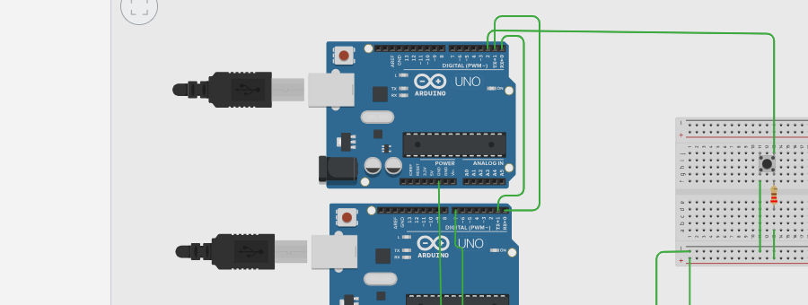
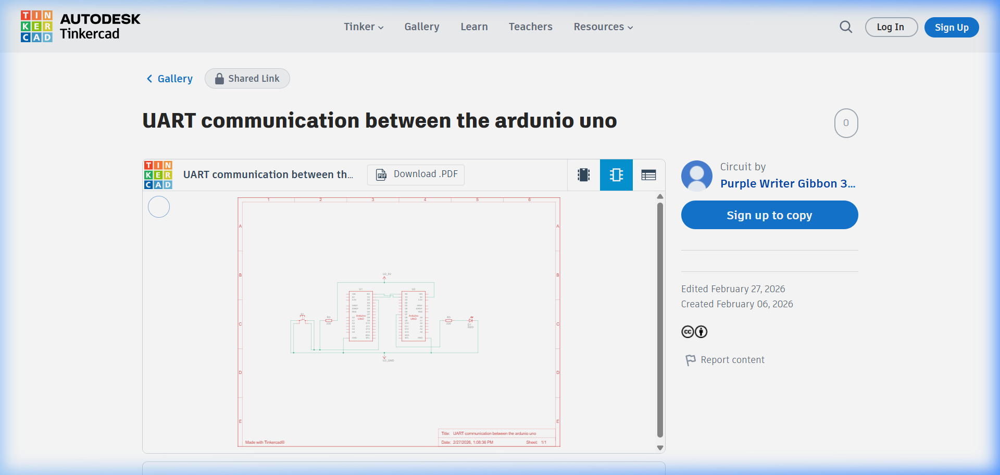
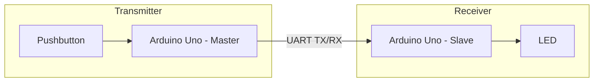

# UART Communication Between Two Arduino Unos

This project demonstrates basic **UART (Universal Asynchronous Receiver-Transmitter)** communication between two Arduino UNO boards. One board acts as a controller (Transmitter) that sends signals based on user input (button), while the other acts as an actuator (Receiver) that responds by toggling an LED.

## Project Overview
The system uses cross-connected TX and RX pins to exchange data. When a button on the Transmitter is pressed, it sends a specific character to the Receiver, which then updates the state of an LED.

## Components Used
- 2x Arduino Uno R3
- 1x Breadboard
- 1x Pushbutton
- 1x LED (Red)
- 1x 220Ω Resistor (for LED)
- 1x 10kΩ Resistor (for Button pull-down)
- Jumper Wires

## Circuit Diagram

### Breadboard View
The physical layout showing the connection of both Arduinos.

### Schematic Diagram
The electrical circuit diagram with UART cross-connections.

## Block Diagram

## Hardware Connections
| Transmitter Pin | Receiver Pin | Connection Type |
|-----------------|--------------|-----------------|
| TX (D1)         | RX (D0)      | UART Data       |
| RX (D0)         | TX (D1)      | UART Data       |
| GND             | GND          | Ground Reference|

**Note:** Both Arduinos must share a common ground for the signal to be referenced correctly.

## How to Use
1.  **Hardware Setup:** Wire the two Arduinos as shown in the Breadboard View.
2.  **Upload Code:**
    - Upload `Transmitter.ino` to the first Arduino.
    - Upload `Receiver.ino` to the second Arduino.
3.  **Operation:**
    - Press the button on the Transmitter Arduino.
    - The LED on the Receiver Arduino will turn **ON** while the button is pressed and **OFF** when released.

## Tinkercad Simulation
The project was designed and tested on Tinkercad.
- **Tinkercad Link:** [UART Communication Project](https://www.tinkercad.com/things/4NzKSQGAl2w-uart-communication-between-the-ardunio-uno-?sharecode=1WHPvHjFA6eD3gOfPEdZcn-mhoUhyRBy8csOB8VV62M)

---
*Created as part of the Arduino Assignment series.*
