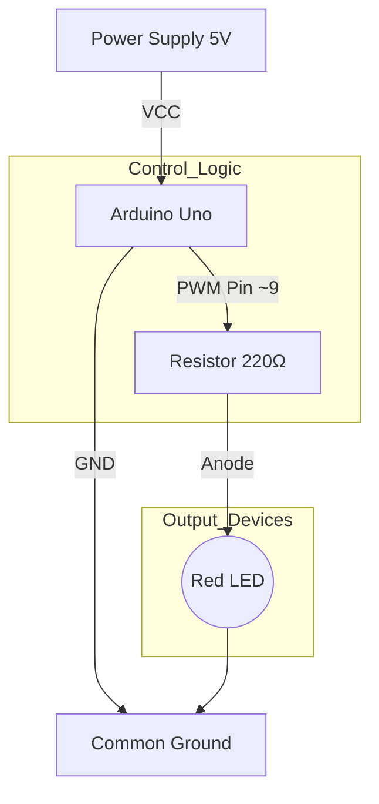
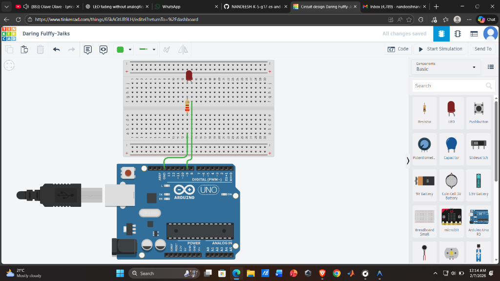
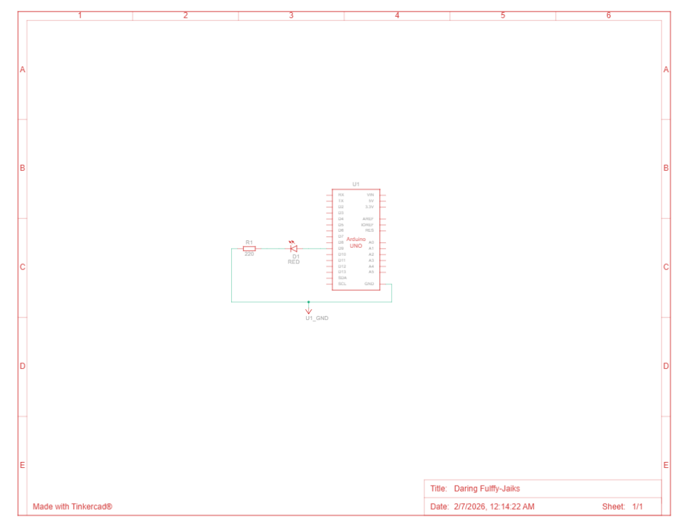

# LED Fading Assignment

## Author
**Nandeesh K S**  
*G17 ES & IOT*

---

## 1. Overview
The **LED Fading** project demonstrates how to control the brightness of an LED using **Pulse Width Modulation (PWM)**. Unlike simple digital blinking (which is only fully ON or fully OFF), PWM simulates analog output by rapidly toggling the LED on and off at varying duties cycles. This creates a smooth "breathing" or fading effect.

### How it Works
1.  **PWM Signal**: The Arduino generates a square wave signal. By changing the "duty cycle" (the percentage of time the signal is HIGH), we control effective brightness.
2.  **Fading In**: The code increases the duty cycle from 0 (0% on) to 255 (100% on).
3.  **Fading Out**: The code decreases the duty cycle from 255 back to 0.

## 2. Block Diagram
Below is the conceptual block diagram of the interface:

## 3. Hardware Requirements
*   1x Arduino Uno (or compatible board)
*   1x Red LED
*   1x Resistor (220Ω)
*   Breadboard and Jumper Wires

## 4. Circuit Connections
| Component | Arduino Pin | Description |
|-----------|-------------|-------------|
| LED (+)   | Pin ~9      | PWM Output  |
| LED (-)   | GND         | Ground      |

*   **Anode (+)**: Connected to Pin 9 via a 220Ω Resistor.
*   **Cathode (-)**: Connected directly to Arduino GND.

## 5. Circuit Diagram & Schematic

### Circuit Diagram

### Schematic

## 6. Simulation & Results
You can view the live simulation of this code and circuit on Tinkercad using the link below:

**[🔗 Open Tinkercad Simulation](https://www.tinkercad.com/things/6SkAGtUB9LH-daring-fulffy-jaiks?sharecode=adicGkyUqVmupBHqzoP8eozi-W62V0rQlkg8BoKRjXI)**

### Output Video
Watch the simulation output in action here:
**[🎥 View Output Simulation Video](https://drive.google.com/file/d/12vnwFbQVOW30c9To9F41LwWNj6R3Xfqa/view?usp=drive_link)**

## 7. Source Code
*   **Main Code**: `src/LED_Fading.ino`

---
*Assignment completed by **Nandeesh K S G17 ES & IOT***
