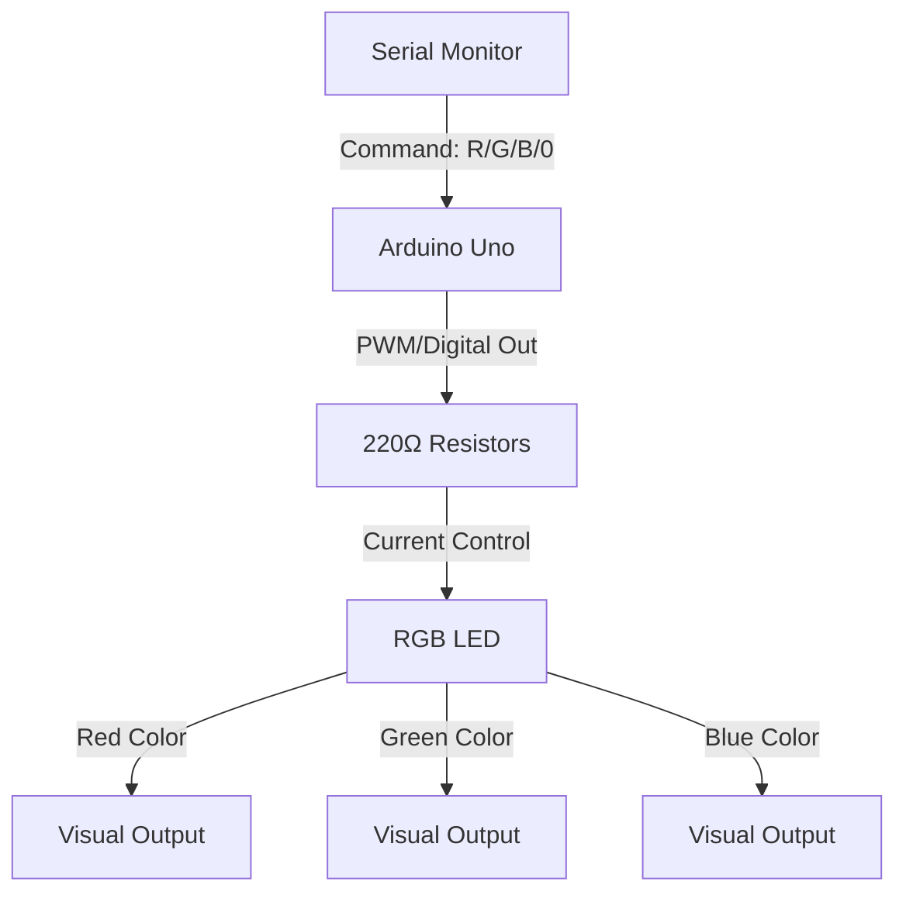
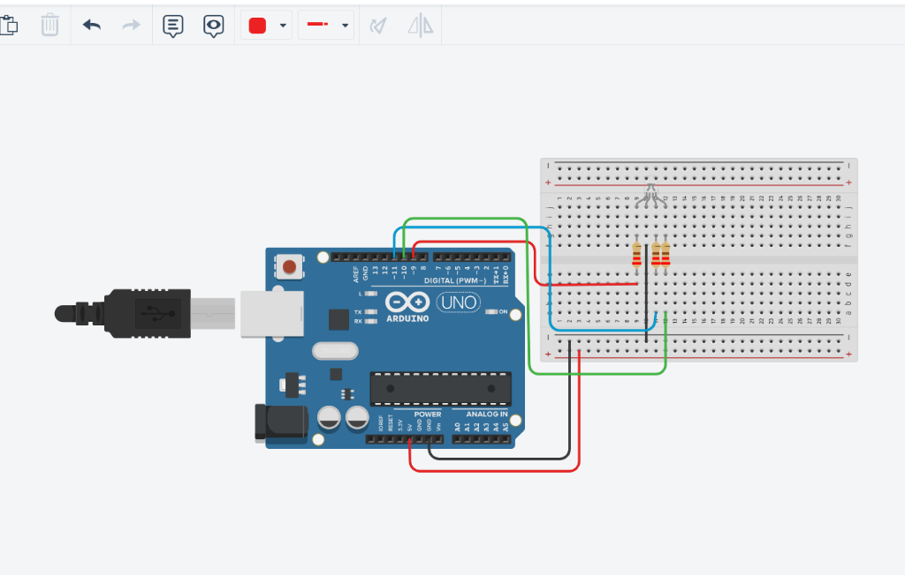
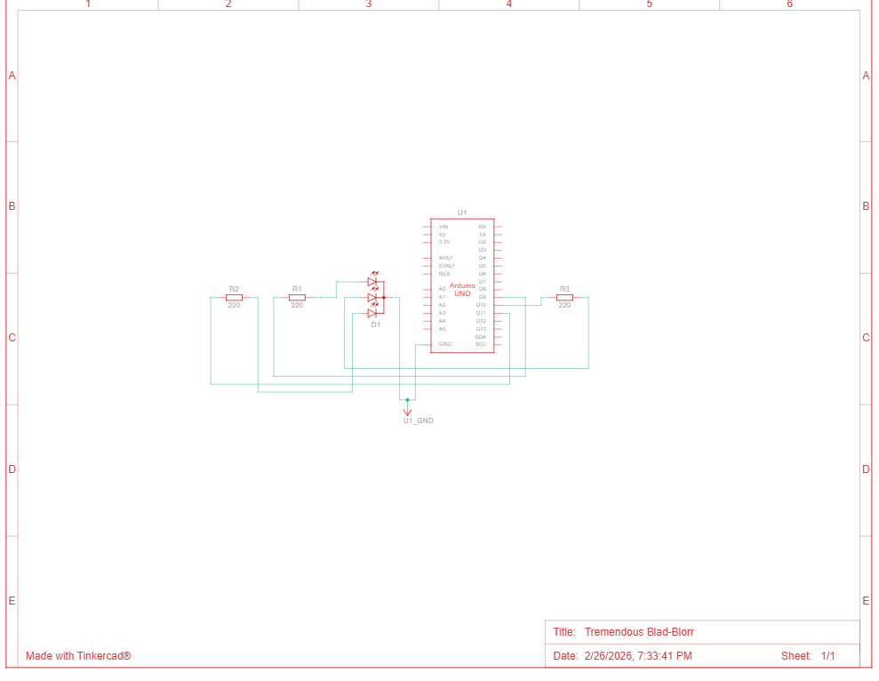
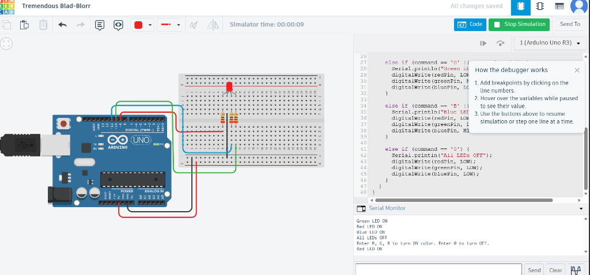
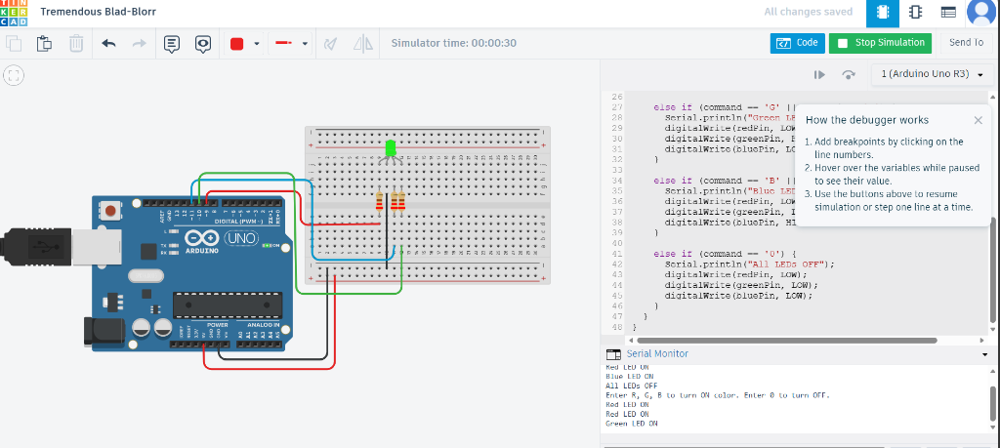
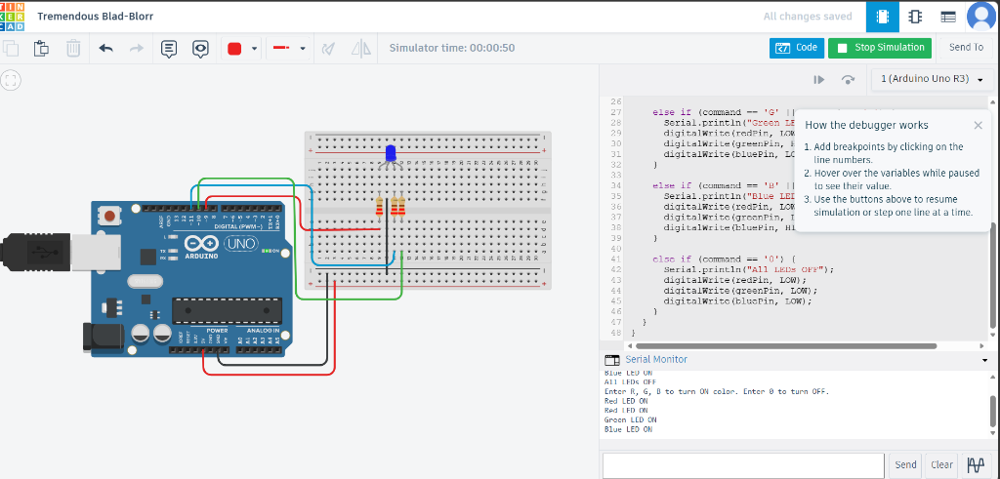
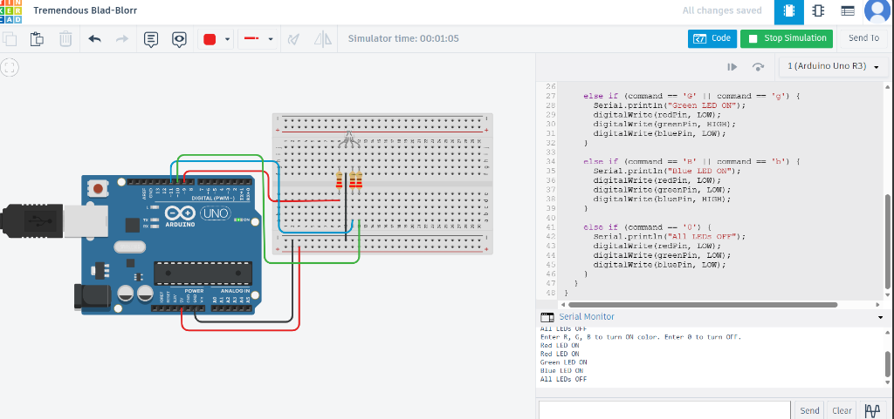

# RGB LED Interface with Arduino

This project demonstrates how to interface an RGB LED with an Arduino Uno and control its colors using serial commands.

## Project Overview
The goal of this experiment is to independently control the Red, Green, and Blue channels of an RGB LED. By sending specific characters via the Serial Monitor, the user can switch between different colors or turn the LED off.

## Components Used
- Arduino Uno R3
- RGB LED (Common Cathode)
- 3x 220Ω Resistors
- Breadboard & Jumper Wires

## Block Diagram

## Circuit Diagram

### Breadboard View

### Schematic Diagram

## Hardware Connections
| Component Pin | Arduino Pin | Resistor |
|---------------|-------------|----------|
| RGB Red       | D9          | 220Ω     |
| RGB Green     | D10         | 220Ω     |
| RGB Blue      | D11         | 220Ω     |
| RGB Cathode   | GND         | None     |

## How to Use
1.  **Hardware Setup:** Wire the circuit as shown in the Breadboard View.
2.  **Upload Code:** Open `code/RGB_LED_Interface.ino` in the Arduino IDE and upload it to your board.
3.  **Serial Monitor:**
    - Open the Serial Monitor (Baud Rate: 9600).
    - Send `R` or `r` to turn on the **Red** LED.
    - Send `G` or `g` to turn on the **Green** LED.
    - Send `B` or `b` to turn on the **Blue** LED.
    - Send `0` to turn **OFF** all colors.

## Results
- The system successfully identifies the serial commands and updates the LED state immediately.
- The colors remain ON until the next command is received, providing a stable interface.
- Serial feedback is provided for every action (e.g., "Red LED ON").

### Simulation Output
| State | Output Image |
|-------|--------------|
| **Red** |  |
| **Green** |  |
| **Blue** |  |
| **OFF** |  |

---
**Tinkercad Result Link:** [Tremendous Blad-Blorr](https://www.tinkercad.com/things/9ZuYqcZLeaA-tremendous-blad-blorr?sharecode=wEHDY51Ko4kkmWdLkGije5ThThuKbMF4HSuNePssYAQ)

