# Snake Pattern LED Assignment

## Author
**Nandeesh K S**  
*G17 ES & IOT*

---

## 1. Overview
The **Snake Pattern LED** project creates a visual effect where a series of LEDs light up in sequence to simulate the movement of a snake. This is achieved by interfacing multiple LEDs with an Arduino Uno microcontroller and controlling their state (ON/OFF) using Digital I/O pins and timing delays.

### How it Works
The "Snake Pattern" relies on the concept of **Persistence of Vision** and sequential timing. 
1.  **Initialization**: The Arduino interprets the LED pins as OUTPUTs.
2.  **Sequential HIGH**: The code loops/iterates through the pin array, turning them ON one by one with a small time delay (e.g., 150ms) between each. This looks like the snake "growing" or moving forward.
3.  **Sequential LOW**: A second loop iterates backwards (or forwards, depending on the pattern), turning the LEDs OFF. This looks like the tail of the snake following the head.

## 2. Block Diagram
Below is the conceptual block diagram of the interface:

```mermaid
graph TD;
    Power[Power Supply 5V] --> |VCC| Arduino[Arduino Uno];
    Arduino --> |GND| CommonGND[Common Ground];
    
    subgraph Control_Logic
    Arduino --> |Digital Pin 2| R1[Resistor 220Ω];
    Arduino --> |Digital Pin 3| R2[Resistor 220Ω];
    Arduino --> |Digital Pin 4| R3[Resistor 220Ω];
    Arduino --> |Digital Pin 5| R4[Resistor 220Ω];
    Arduino --> |Digital Pin 6| R5[Resistor 220Ω];
    Arduino --> |Digital Pin 7| R6[Resistor 220Ω];
    end
    
    subgraph Output_Devices
    R1 --> |Anode| LED1((LED 1));
    R2 --> |Anode| LED2((LED 2));
    R3 --> |Anode| LED3((LED 3));
    R4 --> |Anode| LED4((LED 4));
    R5 --> |Anode| LED5((LED 5));
    R6 --> |Anode| LED6((LED 6));
    end
    
    LED1 --> CommonGND;
    LED2 --> CommonGND;
    LED3 --> CommonGND;
    LED4 --> CommonGND;
    LED5 --> CommonGND;
    LED6 --> CommonGND;
```

## 3. Hardware Requirements
*   1x Arduino Uno (or compatible board)
*   6x LEDs (Red/Green/Blue)
*   6x Resistors (220Ω or 330Ω) to limit current
*   Breadboard and Jumper Wires

## 4. Circuit Connections
| LED Number | Arduino Pin | Description |
|------------|-------------|-------------|
| LED 1      | Pin 2       | Start of Snake |
| LED 2      | Pin 3       | |
| LED 3      | Pin 4       | |
| LED 4      | Pin 5       | |
| LED 5      | Pin 6       | |
| LED 6      | Pin 7       | End of Snake |

*   **Anode (+)**: Connected to the Digital Pins via Resistors.
*   **Cathode (-)**: All connected to Arduino GND.

## 5. Circuit Diagram & Schematic

### Circuit Diagram

### Schematic

## 6. Simulation & Results
You can view the live simulation of this code and circuit on Tinkercad using the link below:

**[🔗 Open Tinkercad Simulation](https://www.tinkercad.com/things/ibkj9pY4urb-snake-led-pattern-?sharecode=CH_3to1B-DDMjsiJC7qsT8PIHEYcGAjvanqVZOlJA2k)**

## 7. Code Variations
*   **Main Code**: `src/snake_fill.ino` (Fills and Unfills the snake)
*   **Alternative**: `src/snake_dot_move.ino` (Single dot moving back and forth)

---
*Assignment completed by **Nandeesh K S G17 ES & IOT***
